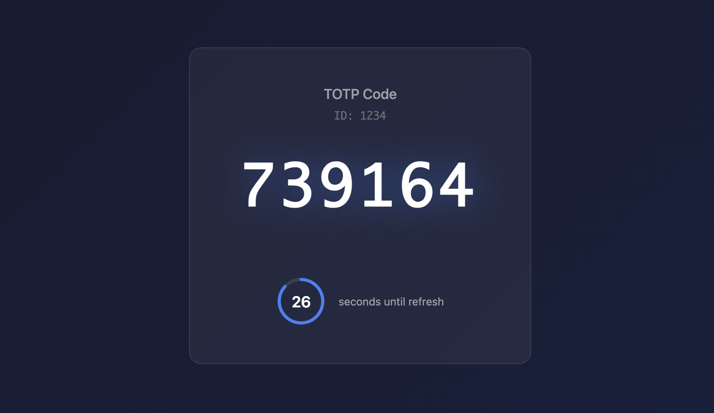
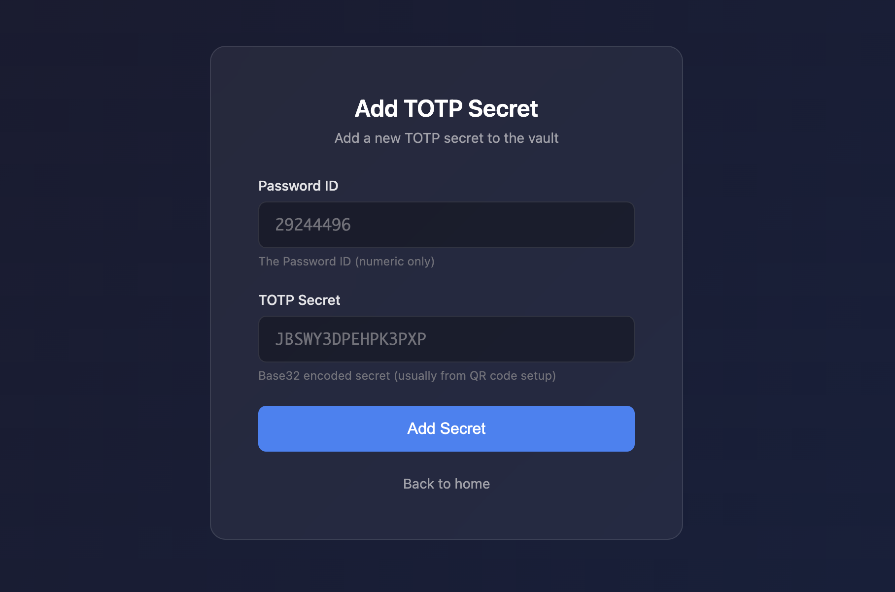

# TOTP Vault

A lightweight Azure Function App that retrieves TOTP codes from Azure Key Vault. Designed for IT teams managing shared service accounts where MFA secrets need to be stored separately from passwords.

Users click a link containing a password ID, authenticate via Entra ID, and receive a TOTP code.

## Screenshots

<p align="center">
  
</p>

<p align="center">
  
</p>

## Deploy to Azure

[](https://portal.azure.com/#create/Microsoft.Template/uri/https%3A%2F%2Fraw.githubusercontent.com%2Femildosen%2Ftotp-vault%2Fmain%2Finfra%2Fazuredeploy.json)

### What gets deployed

| Resource | Purpose |
|----------|---------|
| Function App (Consumption) | Hosts API + frontend |
| Storage Account | Required for Function App |
| Key Vault (Standard) | Stores TOTP secrets |
| Log Analytics Workspace | Audit logging |
| Application Insights | Function App monitoring |

## Post-Deployment Setup

After deployment completes (~5 minutes), configure Entra ID authentication:

### 1. Get Your Function App Hostname

1. Go to **Azure Portal** > **Function Apps** > your app
2. Copy the **URL** from the overview page (e.g., `https://totp-vault-func-abc123.azurewebsites.net`)

### 2. Create Security Group

1. Go to **Microsoft Entra ID** > **Groups** > **New group**
2. Group type: **Security**
3. Name, e.g. `TOTP Vault Users`
4. Add members who should have access
5. Click **Create**
6. Open the group and note the **Object ID**

### 3. Create App Registration

1. Go to **Microsoft Entra ID** > **App registrations** > **New registration**
2. Name, e.g. `TOTP Vault`
3. Supported account types: **Accounts in this organizational directory only**
4. Redirect URI:
   - Platform: **Web**
   - URI: `https://<your-function-app-hostname>/.auth/login/aad/callback`
5. Click **Register**
6. Note the **Application (client) ID** from the overview page

### 4. Configure App Registration

1. Go to **Authentication**
   - Under **Implicit grant and hybrid flows**, enable **ID tokens**
   - Click **Save**

2. Go to **Certificates & secrets** > **New client secret**
   - Add a description and expiry
   - Click **Add**
   - **Note the secret value immediately** (you won't see it again)

3. Go to **Token configuration** > **Add groups claim**
   - Select **Security groups**
   - Click **Add**

### 5. Configure Function App Authentication

1. Go to **Azure Portal** > **Function Apps** > your app
2. Go to **Settings** > **Authentication**
3. Click **Add identity provider**
4. Select **Microsoft**
5. Configure:
   - **App registration type**: Pick an existing app registration
   - **Application (client) ID**: Your app registration client ID
   - **Client secret**: Your client secret from step 4
   - **Issuer URL**: `https://sts.windows.net/<your-tenant-id>/v2.0`
   - **Allowed token audiences**: `api://<your-client-id>`
6. Click **Add**

### 6. Configure Function App Settings

1. Go to **Settings** > **Environment variables**
2. Add this application setting:

| Name | Value |
|------|-------|
| `ALLOWED_GROUP_ID` | Security group Object ID from step 2 |

3. Click **Apply**

### 7. Add TOTP Secrets

1. Go to **Azure Portal** > **Key Vaults** > your Key Vault
2. Go to **Objects** > **Secrets** > **Generate/Import**
3. Name: `totp-<password-id>` (e.g., `totp-29244496`)
4. Secret value (normal or JSON):

Normal:
`BASE32ENCODEDSEED`

Or JSON:
   ```json
   {"secret":"BASE32ENCODEDSEED"}
   ```
5. Click **Create**

## Usage

Share links with users:
```
https://<your-function-app-hostname>/code/<password-id>
```

Users authenticate via Entra ID and see the current TOTP code with a countdown timer.

## Security

- TOTP seeds never leave the Function - only generated codes return to browser
- Managed Identity for Key Vault access (no secrets in code)
- Use Conditional Access for phishing-resistant MFA
- All retrievals logged with user identity
- Group membership required for access

## Documentation

See [docs/setup.md](docs/setup.md) for detailed setup instructions and troubleshooting.

## License

MIT
